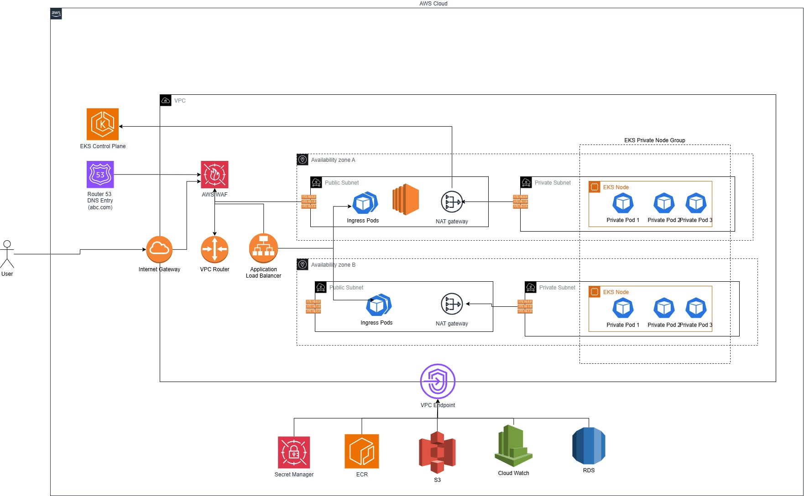

## Assumptions

### Infrastructure Assumptions
- **EKS Cluster**: Runs across 2 availability zones with private worker nodes
- **Load Balancing**: Application Load Balancer (ALB) handles ingress traffic
- **Network Security**: VPC endpoints used for all sensitive AWS services
- **SSL Certificates**: Self-signed ACM certificates for dev/staging, valid certificates for production
- **Encryption**: KMS encryption enabled by default for all data at rest
- **High Availability**: Multi-AZ deployment for RDS and EKS cluster resilience

### Application Assumptions
- **Transaction Volume**: Designed to handle moderate transaction volumes (1000-10000 transactions/day)
- **Data Retention**: Transaction data retained for 7 years for compliance requirements
- **API Rate Limits**: 100 requests per minute per IP address
- **Session Management**: JWT tokens with 15-minute expiration for security
- **Database Connections**: Connection pooling configured for optimal performance

### Security Assumptions
- **PCI DSS Compliance**: Level 1 compliance implemented for financial data handling
- **Network Isolation**: Private subnets for application components, public subnets only for ALB
- **Data Encryption**: All data encrypted in transit (TLS 1.2+) and at rest (AES-256)
- **Access Control**: Role-based access control with least privilege principles
- **Audit Logging**: Comprehensive logging for all transaction access and modifications

### Operational Assumptions
- **Deployment Strategy**: Blue-green deployment for zero-downtime updates
- **Monitoring**: CloudWatch integration for logs, metrics, and alerting
- **Backup Strategy**: Automated RDS backups with point-in-time recovery
- **Scaling**: Horizontal pod autoscaling based on CPU and memory utilization
- **Disaster Recovery**: Multi-AZ deployment with automated failover capabilities

### Compliance Assumptions
- **Data Privacy**: No PII data stored, only transaction metadata
- **Audit Trail**: Complete audit trail for all data access and modifications
- **Security Scanning**: Regular vulnerability scanning with Trivy and Bandit
- **Access Logging**: All API access logged with correlation IDs for tracing
- **Data Masking**: Card numbers masked in logs and responses (first 6, last 4 digits only)

### Multi-Region Disaster Recovery Assumptions
- **Active/Active Configuration**: Identical architecture deployed across multiple AWS regions
- **Cross-Region Replication**: RDS read replicas and S3 cross-region replication
- **Global Load Balancing**: Route 53 health checks and traffic distribution
- **Active/Passive DR Strategy**: Secondary regions in standby mode
- **Regional Independence**: Each region operates independently

## Open Questions

### Disaster Recovery & Business Continuity
- **RTO (Recovery Time Objective)**: What is the acceptable downtime for application restoration?
  - *Current Assumption*: 4 hours maximum for full system recovery
  - *Consideration*: Multi-AZ deployment should reduce RTO to 1-2 hours
- **RPO (Recovery Point Objective)**: What is the acceptable data loss window?
  - *Current Assumption*: 15 minutes maximum data loss acceptable
  - *Consideration*: RDS automated backups every 5 minutes should meet this requirement
- **Disaster Recovery Stages**: What are the required recovery stages?
  1. **Immediate Response** (0-15 minutes): Incident detection and assessment
  2. **Initial Recovery** (15-60 minutes): Failover to secondary AZ
  3. **Full Restoration** (1-4 hours): Complete system recovery and validation
  4. **Business Continuity** (4+ hours): Long-term stability and monitoring

### Security & Compliance Scanning
- **Snyk Integration**: Advanced dependency vulnerability scanning
  - *Status*: Currently implemented in CI/CD pipeline
  - *Question*: Should Snyk be configured for real-time monitoring?
- **Linting Requirements**: Code quality and style enforcement
  - *Current Tools*: Black, isort, flake8, mypy
  - *Question*: Should additional linting tools be added (pylint, ruff)?
- **TFSec Scanning**: Infrastructure security validation
  - *Status*: Implemented for Terraform security checks
  - *Question*: Should TFSec be configured for policy enforcement?
- **Trivy Scanning**: Container and filesystem vulnerability detection
  - *Status*: Implemented for container image scanning
  - *Question*: Should Trivy be configured for continuous monitoring?
- **SonarQube Integration**: Comprehensive code quality analysis
  - *Status*: Not currently implemented
  - *Question*: Should SonarQube be added for advanced code quality metrics?

### Infrastructure & Operations
- **IAM Role for VPC Flow Logs**: Currently created manually
  - *Question*: Should this be automated through Terraform?
- **WAF Implementation**: Web Application Firewall if attached
  - *Question*: When should WAF be implemented for production?
- **Monitoring & Alerting**: Current CloudWatch integration
  - *Question*: Should additional monitoring tools be considered (Datadog, New Relic)?
- **Backup Strategy**: Current RDS automated backups
  - *Question*: Should cross-region backup replication be implemented?

### Security & Vulnerability Assessment
- **VAPT (Vulnerability Assessment & Penetration Testing)**: Security testing requirements
  - *Question*: Should automated VAPT be integrated into CI/CD pipeline?
  - *Consideration*: OWASP ZAP, Burp Suite, or custom security testing tools
  - *Risk*: May increase build time and require specialized security expertise

 ## Risks

### Build & Deployment Optimization
- **Build Time vs Image Size Trade-offs**: Container optimization decisions
  - *Question*: Should multi-stage builds be optimized for smaller images?
  - *Trade-off*: Larger build time vs smaller runtime image size
  - *Consideration*: Alpine vs Ubuntu base images, dependency optimization
- **CI Machine Resource Management**: Build environment constraints
  - *Question*: Should self-hosted runners be used for better resource control?
  - *Risk*: GitHub-hosted runners have limited resources and time constraints
  - *Consideration*: Parallel builds, caching strategies, resource optimization

### Branch Management & Release Strategy
- **Git Flow vs GitHub Flow**: Branch management approach
  - *Question*: Should feature branches be protected with mandatory reviews?
  - *Consideration*: Main branch protection, automated testing on PRs
- **Release Management**: Version control and deployment strategy
  - *Question*: Should semantic versioning be enforced automatically?
  - *Risk*: Manual version management can lead to inconsistencies
- **Environment Promotion**: Dev → Staging → Production pipeline
  - *Question*: Should manual approval gates be implemented for production?
  - *Consideration*: Automated testing, security scans, performance validation

